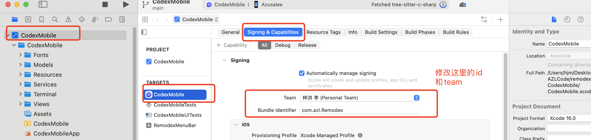
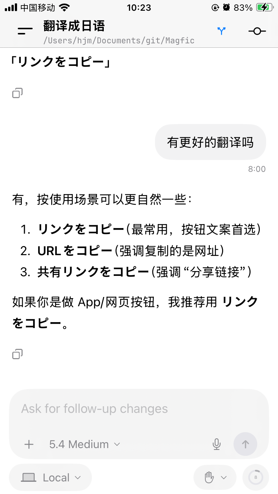

# 快速开始

安装好codex的app和codex cli

运行CodexMobile, 需要修改项目的bundleid和证书, 把app安装到自己手机上，项目最低支持的ios版本为18.0。

电脑打开命令行，跑这几个命令就行了
npm install -g remodex@latest
remodex restart
remodex up

然后出现一个二维码，手机打开CodexMobile的app扫这个二维码就可以匹配上了

然后就可以通过手机跟电脑上的codex沟通

# 详细

如下图所示，修改成自己的team和bundle id。

手机上app的效果

